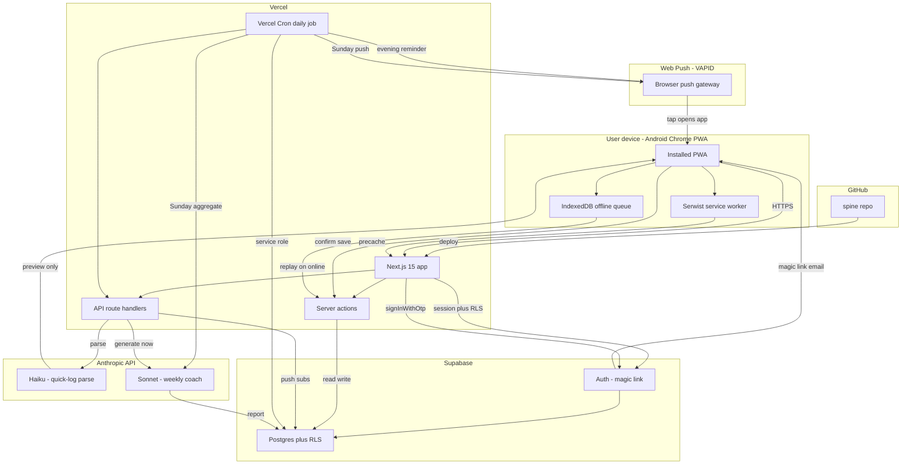

# Architecture: Spine

## 1. Stack (final, do not relitigate mid-build)

| Layer | Choice | Why |
|---|---|---|
| Framework | Next.js 15, App Router, TypeScript strict | One repo, one deploy, server actions kill most API boilerplate |
| UI | Tailwind CSS + shadcn/ui + Recharts | Fast, consistent, chart lib that handles time series well |
| PWA | @serwist/next (service worker, offline queue, push) | Maintained successor to next-pwa |
| DB + Auth | Supabase (Postgres, RLS, magic link) | Relational data, SQL reporting, auth in 10 minutes |
| LLM | Anthropic API. Parser: claude-haiku-4-5-20251001. Coach: claude-sonnet-4-6 | Haiku = cheap/fast structured extraction; Sonnet = quality weekly reasoning. Verify current model names at https://docs.claude.com/en/api/overview |
| Push | web-push (VAPID) + Supabase push_subscriptions table | Standard Web Push, works on Android Chrome |
| Scheduling | Vercel Cron: ONE daily job 20:30 local-equivalent UTC | Hobby plan constraint: keep to a single daily cron; Sunday logic branches inside it |
| Deploy | Vercel, GitHub integration, preview deploys | Already in your workflow |
| Validation | zod everywhere data crosses a boundary | Especially re-validating LLM tool output |

Explicitly rejected: FastAPI/Railway (second deploy for zero benefit at this scale), LangGraph (no multi-step agent workflows exist here; two single-call LLM jobs), Firebase (document store fights relational reporting).

## 1a. System architecture

> **Viewing this diagram:** Cursor's default markdown preview does not render Mermaid. Use one of:
> - Install the **Markdown Preview Mermaid Support** extension, then reopen preview
> - View this file on GitHub (renders Mermaid natively)



**How each service is used**

| Service | Role in Spine |
|---|---|
| **GitHub** | Hosts the repo; pushes trigger Vercel builds and preview deploys. |
| **Vercel** | Runs the Next.js app (UI, server actions, API routes, middleware). Hosts the single daily cron job. |
| **Supabase Auth** | Magic-link login; session tied to `auth.users`. `ALLOWED_EMAILS` gates access in middleware. |
| **Supabase Postgres** | All persistent data. RLS enforces per-user isolation on every table. |
| **Anthropic (Haiku)** | Parses free-text quick-log into structured preview via forced tool use; never writes to DB. |
| **Anthropic (Sonnet)** | Generates weekly coach markdown from 28 days of aggregated data; `RISK_FLAG` stored in `weekly_reports`. |
| **VAPID / Web Push** | Evening and Sunday reminders. Subscriptions stored in Supabase; `web-push` sends from cron. |
| **Serwist** | Service worker: app-shell precache, offline reads, push + notificationclick handlers. |
| **IndexedDB** | Queues habit/score mutations offline; replays via server actions on reconnect. |

**Credential boundaries**

- **Browser / PWA:** publishable (anon) key + user session only.
- **Server (actions, most routes):** publishable key + session; RLS applies.
- **Cron + coach generation:** service role (secret) key only — never in client bundles.
- **Anthropic API key:** server-only (`/api/quick-log/parse`, coach routes, cron Sunday branch).
- **CRON_SECRET:** Vercel sends `Authorization: Bearer` on cron invocations; route returns 401 otherwise.

## 2. Data model (authoritative DDL in 03_schema.sql)

- `profiles` 1:1 with auth.users; timezone, reminder prefs.
- `habit_definitions` seeded fixed set; `input_type` in ('boolean','count').
- `daily_logs` unique (user_id, log_date); back_score, stress_score, sleep_hours, notes.
- `habit_entries` unique (user_id, log_date, habit_id); numeric value (booleans as 0/1).
- `milestones` category, target_date, status, criteria_text, sort.
- `flare_events` started_on, ended_on nullable, severity, suspected_trigger, notes.
- `weekly_reports` unique (user_id, week_start); content_md, risk_flag, model.
- `push_subscriptions` endpoint unique; keys.

All tables RLS: `user_id = auth.uid()`. Service-role key used ONLY inside cron route handlers.

## 3. App surface

### Server actions (mutations)
`upsertDailyScores(date, {back, stress, sleep})`, `toggleHabit(date, habitId, value)`, `startFlare(severity)`, `endFlare(id, trigger, notes)`, `updateMilestone(id, patch)`, `saveQuickLog(confirmedPayload)`.

### Route handlers
- `POST /api/quick-log/parse` -> calls Haiku with tool schema, returns preview payload (NO db write).
- `POST /api/push/subscribe` and `/unsubscribe`.
- `GET /api/cron/daily` (Vercel Cron, protected by CRON_SECRET header):
  - every day: find users with incomplete today -> send "Complete your spine" push.
  - if Sunday: aggregate last 28 days -> call Sonnet coach -> insert weekly_reports -> send report push.
- `POST /api/coach/generate-now` (rate limit 1/day) same generation path.

### Pages
`/` Today, `/dashboard` (nav label "Trends"), `/guide`, `/milestones` (nav label "Plan"), `/coach`, `/flare` (modal route), `/login`.

### In-app guide layer (July 2026 UI update)
The original recovery document is fully embedded in the app so the user never needs to open it:

- **`/guide` tab** — the whole guide restructured as collapsible sections: why the program, per-habit how-tos, self-tests + PT script, training phases 0-3, flare playbook, supplement verdicts, glossary, success definition. Deep-linkable via `?habit=<id>` or `?section=<id>` (target section auto-expands and scrolls).
- **`lib/guideContent.ts`** — single source of truth for all guide copy (typed constants; no DB involvement).
- **SpineWidget segments are labeled** — each shows the habit name + live status (checkmark or `2/3` count), with an ⓘ button opening a how-to dialog for that habit.
- **Milestones link to instructions** — e.g. "Directional preference result recorded" links to the self-test how-to in the guide.
- **Plain-language scores** — dials are "Back pain (1-10)", "Stress (1-10)", "Sleep (hours)" with scale anchors in the edit dialog; quick-log preview shows friendly habit names.

## 4. LLM integration pattern

Both calls go through one thin client `lib/anthropic.ts` using fetch to `https://api.anthropic.com/v1/messages` (or the official TS SDK; either is fine, pick SDK).

**Parser (Haiku):** tool-use with a single tool `log_day` whose input schema mirrors zod `QuickLogSchema` (03 of this doc + 06 prompts). `tool_choice: {type:"tool", name:"log_day"}` forces structured output. Server re-validates with zod. Unparseable fragments land in `unparsed_notes`. Response returned to client as a PREVIEW; user confirms; only then does `saveQuickLog` write.

**Coach (Sonnet):** system prompt = CLINICAL_CONTEXT + COACH_INSTRUCTIONS (both verbatim constants from 06). User message = JSON blob: 28 days of logs, habit adherence rates, flares, upcoming milestones, current phase. Output = markdown + a final line `RISK_FLAG: green|amber|red` parsed by regex into the risk_flag column.

Env: `ANTHROPIC_API_KEY`, `SUPABASE_URL`, `SUPABASE_ANON_KEY`, `SUPABASE_SERVICE_ROLE_KEY`, `ALLOWED_EMAILS`, `CRON_SECRET`, `VAPID_PUBLIC_KEY`, `VAPID_PRIVATE_KEY`.

## 5. Folder structure

```
app/
  (app)/            # authed group: layout with bottom tabs
    page.tsx        # Today
    dashboard/page.tsx
    guide/page.tsx  # in-app recovery manual (deep-linkable)
    milestones/page.tsx
    coach/page.tsx
    flare/page.tsx  # modal route
  login/page.tsx
  api/
    quick-log/parse/route.ts
    push/subscribe/route.ts
    cron/daily/route.ts
    coach/generate-now/route.ts
components/
  spine/SpineWidget.tsx   # signature component (labeled segments + how-to dialogs)
  GuideClient.tsx         # collapsible guide sections
  ScoreDial.tsx  QuickLogBox.tsx  FlareChecklist.tsx
  charts/TrendChart.tsx  AdherenceBars.tsx  FlareBand.tsx
lib/
  supabase/ (client.ts, server.ts, middleware.ts)
  anthropic.ts  push.ts  dates.ts  schemas.ts (zod)
  guideContent.ts  # all in-app guide copy (habit how-tos, glossary, phases...)
  prompts.ts    # constants copied verbatim from docs/06
docs/             # PRD, ARCHITECTURE, llm prompts (kit files live here)
public/           # manifest, icons, sw
```

## 6. Design tokens (from PRD section 7; implement as CSS vars + Tailwind theme)

The identity is "lamplight ledger": the app is used at night before bed, so it reads
like a journal under a warm lamp, not a monitoring console.

```
--bg:         #171310   (warm ink)
--surface:    #211B16
--surface-2:  #2B231C   (interactive / elevated)
--line:       #43372C
--text:       #F3EBDD   (warm cream)
--text-dim:   #A79883
--accent:     #E3A857   (candle gold: completed states, spine fill, identity)
--accent-dim: #453317
--warn:       #C9773B   (burnt orange: risk flags only)
--flare:      #D9605B   (clay red: Flare Mode only)
fonts: display "Fraunces" (variable serif, italic for greeting/wordmark);
       body "IBM Plex Sans"; mono "IBM Plex Mono"
radius: 14px; spacing base 4px; touch targets >= 48px
atmosphere: fixed radial gold lamplight upper-left + warm umber pool lower-right (CSS only)
motion: spine segment fill 160ms; alignment sweep 1100ms on 6/6; nav underline 180ms;
        sheet enter 200ms; respect prefers-reduced-motion
```

The SpineWidget: 6 stacked rounded-rectangle "vertebrae" (widest at L3/L4, tapering
top and bottom) joined by small "disc" pills that light up when both neighboring
vertebrae are complete. Unfilled = --surface-2 with --line border; filled = candle-gold
gradient with a soft glow. Completing the sixth vertebra fires a warm light sweep down
the column. Each segment carries its habit label + live status and a sibling ⓘ how-to
button. The lit column is the only signature decorative element.

## 7. Offline strategy

Serwist precache shell; runtime cache GETs stale-while-revalidate. Mutations while offline enqueue to IndexedDB (simple queue in `lib/offlineQueue.ts`) and flush on `online` event. Today screen reads render from local cache first. Conflict rule: last-write-wins per field (single user, acceptable).

## 8. v2 parking lot (do not build now)

Bubblewrap TWA for Play Store APK; Google Fit steps auto-import; per-habit reminder times; CSV export; Sorensen test timer with history chart; light theme refinement.
