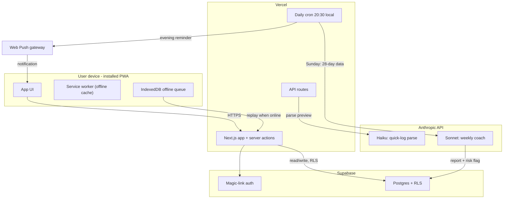

# Spine — Project Brief (handoff document)

Last updated: July 9, 2026. Purpose: a single self-contained file describing what Spine is, how it works, what it costs, and where it can go — written to be pasted into any other working session (e.g. business planning) as complete context. Deeper technical detail lives in `docs/ARCHITECTURE.md`, `docs/PRD.md`, and `docs/PHASE2_MULTI_USER_PLAN.md`.

---

## 1. What Spine is

Spine is a **personal back-recovery companion app**: an installable mobile web app (PWA) that turns a long clinical recovery guide into a daily habit tracker, trend dashboard, and AI coach. It was built for one user recovering from recurrent lower-back spasms, executing a multidisciplinary recovery program over 9-12 months.

The core insight: recovery programs fail not from bad advice but from non-adherence and from the patient having to re-read a 150-line document to know what to do. Spine collapses that document into:

- a **6-item daily checklist** (the "daily six") rendered as a spine-shaped widget — one tap per habit
- **3 nightly numbers** (back pain 1-10, stress 1-10, sleep hours) that statistically predict this user's flares 1-2 days in advance
- a **free-text quick log** ("3 walks, did the big 3, back pain 4, slept 7.5") parsed by an LLM into structured data, previewed, then saved
- an **in-app Guide tab** containing the entire recovery manual: step-by-step exercise how-tos, self-test instructions, a word-for-word script for the physical-therapist visit, training phases, a flare playbook, supplement verdicts, and a glossary of every term the app uses
- a **weekly AI coach report** (generated Sundays) that reads 28 days of data and writes a short markdown report with strictly correlational observations, one behavioral focus for next week, and a green/amber/red risk flag
- **flare mode**: a calm step-by-step playbook for the first 48 hours of a spasm episode, plus ER red-flag criteria
- **milestones ("Plan" tab)**: the one-time checkpoints of the program (PT eval, baselines, phase exits), each linked to its how-to in the Guide
- **push reminders**: evening nudge if the day is incomplete; Sunday report notification
- **offline support**: logging works without connectivity and syncs when back online

Status: **feature-complete v1, deployed on Vercel, in daily use by one user.** A major UI clarity overhaul (labeled widgets, in-app Guide, plain-language everything) shipped July 9, 2026.

## 2. Who it's for (today and potentially)

- **Today:** one user (the owner), email-allowlisted, single-tenant in practice.
- **Architecturally:** already multi-user safe — every table is per-user with row-level security, the cron loops over all profiles, onboarding is "add an email to the allowlist."
- **Potential audiences:** people on structured MSK (musculoskeletal) recovery programs; PT clinics wanting between-visit adherence tracking; the broader "evidence-based back pain self-management" market. The differentiators are (a) the program is embedded, not generic, (b) free-text logging with LLM parsing removes friction, (c) the coach reasons over the user's own longitudinal data with clinician-set guardrails.

## 3. Architecture at a glance

**Stack:** Next.js 15 (App Router, TypeScript) on Vercel · Supabase (Postgres + row-level security + magic-link auth) · Anthropic API (Haiku for parsing, Sonnet for weekly coaching) · Serwist PWA (service worker, offline queue) · Web Push (VAPID) · Vercel Cron (one daily job).

**Key design decisions**

| Decision | Rationale |
|---|---|
| Single repo, single deploy (no separate backend) | Server actions + API routes cover everything at this scale |
| LLM parses to a *preview*, user confirms, only then written to DB | LLM never writes data directly; zod re-validates all LLM output |
| Coach prompt = clinical context + strict instructions | Correlational language only, never diagnoses, red-flag symptoms override the whole report with "seek urgent care" |
| All guide content in one typed constants file (`lib/guideContent.ts`) | Content edits are code edits; no CMS, no DB migration |
| One daily cron with Sunday branch | Vercel Hobby plan allows one; scales to paid plan trivially |

**Data model (7 tables, all per-user with RLS):** profiles, habit_definitions (seeded), daily_logs (scores per date), habit_entries, milestones (cloned from templates on first login), flare_events, weekly_reports, push_subscriptions.

**Credential boundaries:** browser gets only the publishable Supabase key + user session; the service-role key exists only in cron/coach server code; the Anthropic key is server-only; cron is protected by a bearer secret.

## 4. Operating cost (current, single user)

| Item | Cost |
|---|---|
| Vercel Hobby | $0 |
| Supabase Free tier | $0 |
| Anthropic API | < $0.50/month (≈30 Haiku parses + 4-5 Sonnet reports) |
| **Total** | **effectively the LLM pennies** |

Per additional active user: **well under $0.50/month** in LLM costs. Free tiers hold to roughly 5-10 casual users; beyond that, Supabase Pro ($25/mo) and Vercel Pro ($20/mo) are the first paid steps.

## 5. Growth path (Phase 2 plan, written but not implemented)

Full detail in `docs/PHASE2_MULTI_USER_PLAN.md`. Summary:

- **The architecture already supports multiple users.** The four real gaps: (1) the coach prompt hardcodes the owner's clinical history — must become per-profile with a generic fallback; (2) the quick-log parse endpoint needs a per-user daily rate limit; (3) Supabase's built-in mailer (~3-4 magic links/hour) needs replacing with custom SMTP; (4) habits/milestones are the owner's specific program — fine for similar recovery cases, genericizing is optional.
- **Stage 1 (small):** shared Anthropic key + per-user clinical context + rate limits + spend cap + custom SMTP. Adds trusted users at trivial cost.
- **Stage 2 (optional):** bring-your-own-API-key with server-side encryption, for isolation or >5-10 users.
- **v2 parking lot:** Play Store packaging (TWA), Google Fit step import, CSV export, per-habit reminder times, Sorensen test timer.

## 6. What would matter in a business framing

Honest positioning notes for planning purposes:

- **The moat is the program-to-product pipeline, not the code.** The codebase is a competent but replicable PWA. The interesting asset is the pattern: take a clinician-authored recovery protocol → embed it as structured habits, milestones, guides, and coach guardrails → LLM handles friction (free-text logging) and synthesis (weekly reports) without ever being allowed to improvise medically.
- **Regulatory line:** Spine deliberately stays on the "wellness/adherence tool" side — it never diagnoses, never adjusts the medical program, uses correlational language only, and hard-codes red-flag escalation to in-person care. Crossing into personalized medical advice would change the regulatory category entirely.
- **Unit economics are excellent:** sub-$1/user/month variable cost against subscription-tier pricing typical for health apps.
- **The single-tenant version is the demo.** One real user with real longitudinal data, real flare predictions, and a real clinical document embedded is a stronger proof than a generic mockup.
- **Realistic B2B angle:** PT/physio clinics prescribing "their program, in an app" between visits, with the clinician writing the clinical context the coach reasons within. The allowlist model maps naturally to a clinic roster.

## 7. Repo map (for any future session)

| Path | What it is |
|---|---|
| `docs/PRD.md` | Product requirements (v1) |
| `docs/ARCHITECTURE.md` | Full technical architecture with detailed diagram |
| `docs/PHASE2_MULTI_USER_PLAN.md` | Multi-user enablement plan + cost math |
| `docs/PROJECT_BRIEF.md` | This file |
| `docs/Original_Recommendation/back_recovery_guide_final.md` | The source clinical guide the app embeds |
| `SETUP.md` | Step-by-step deployment instructions (Supabase, Vercel, env vars) |
| `03_schema.sql` | Authoritative database schema + seed data |
| `lib/guideContent.ts` | All in-app guide copy |
| `lib/prompts.ts` | LLM system prompts (parser, coach, clinical context) |
